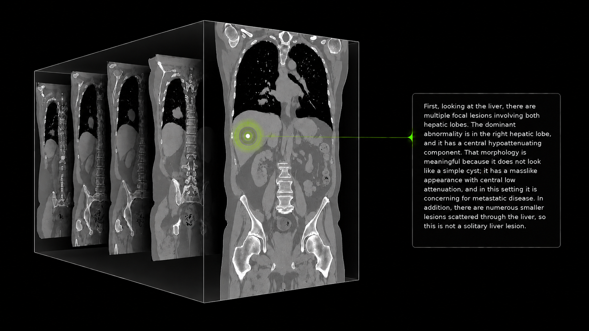

# NV-Reason-CT

[](https://huggingface.co/nvidia/NV-Reason-CT)
[](https://github.com/NVIDIA-Medtech/NV-Reason-CT)
[](https://huggingface.co/spaces/nvidia/nv-reason-ct)
[](https://arxiv.org/abs/2609.27511)
[](LICENSE)

NV-Reason-CT is a 3D vision-language model (VLM) for CT image analysis. It
combines a native 3D vision encoder (3D ViT) with a language model and is
designed for radiology report generation, general question answering, and
multi-step reasoning across chest and abdominal CT volumes.

Computed tomography encodes clinically important anatomy across hundreds of
slices, yet most vision–language systems either operate on 2D images or
compress volumetric features before language decoding. The 3D vision encoder
converts a 384×384×384-mm input volume into a 24×24×24 grid of 13,824 visual
tokens. All tokens and their corresponding 3D positions are passed to the
language model without spatial downsampling, while 3D MRoPE preserves their
spatial relationships within the LLM. Input volumes are automatically cropped
to the chest or abdomen and resampled to 2-mm isotropic resolution before
processing.

The model was trained end-to-end using Supervised Fine-Tuning (SFT) and Group
Relative Policy Optimization (GRPO) on a curated dataset of approximately
550,000 structured QA examples from 70,111 unique CT volume inputs. The
training corpus integrates standardized reports, abnormality-focused QA,
multi-turn interactions, and radiologist-authored reasoning collected through
recorded and transcribed expert CT interpretations. These expert annotations
also guide the generation of report-grounded synthetic reasoning data for SFT,
while GRPO uses verifiable rewards over chest and abdominal abnormality sets.



## Installation

Python 3.11+ and a CUDA-capable PyTorch installation are recommended.

```bash
python -m pip install -r https://huggingface.co/nvidia/NV-Reason-CT/resolve/main/requirements.txt
```

## Quick Start

The example below loads the model once and defines a reusable function for
deterministic inference on `.nii.gz` volumes. Use `anatomy_region="chest"`
for a chest crop or `anatomy_region="abdomen"` for an abdominal crop.

```python
import torch
from transformers import AutoModelForImageTextToText, AutoProcessor

model_id = "nvidia/NV-Reason-CT"
ct_path = "path/to/volume.nii.gz"

model = AutoModelForImageTextToText.from_pretrained(
    model_id,
    trust_remote_code=True,
    dtype=torch.bfloat16,
    attn_implementation="sdpa",
).eval().to("cuda")

processor = AutoProcessor.from_pretrained(
    model_id,
    trust_remote_code=True,
)

def generate_response(
    ct_path,
    prompt_text,
    anatomy_region="chest",
    enable_thinking=True,
    max_new_tokens=2048,
):
    messages = [
        {
            "role": "user",
            "content": [
                {"type": "image"},
                {"type": "text", "text": prompt_text},
            ],
        }
    ]
    prompt = processor.apply_chat_template(
        messages,
        tokenize=False,
        add_generation_prompt=True,
        enable_thinking=enable_thinking,
    )
    inputs = processor(
        text=prompt,
        images3d=[ct_path],
        anatomy_region=anatomy_region,
        return_tensors="pt",
    ).to(model.device)

    with torch.inference_mode():
        generated_ids = model.generate(
            **inputs,
            max_new_tokens=max_new_tokens,
            do_sample=False,
            use_cache=True,
        )

    new_tokens = generated_ids[:, inputs.input_ids.shape[1]:]
    return processor.batch_decode(
        new_tokens,
        skip_special_tokens=True,
        clean_up_tokenization_spaces=False,
    )[0]


# Structured report (Chest region)
print(generate_response(ct_path, "Write a structured chest CT report.", anatomy_region="chest"))
```

The same loaded model can be reused with other prompts and anatomy regions.

```python
# Structured report (Abdominal region)
print(generate_response(ct_path, "Write a structured abdominal CT report.", anatomy_region="abdomen"))

# Reasoning (Chest region)
print(generate_response(ct_path, "Provide a full reasoning analysis of this chest CT.", anatomy_region="chest"))

# Reasoning (Abdominal region)
print(generate_response(ct_path, "Provide a full reasoning analysis of this abdominal CT.", anatomy_region="abdomen"))

# Binary question with reasoning
print(generate_response(ct_path, "Is a pleural effusion present in this CT?", anatomy_region="chest"))

# Concise Yes/No response without thinking
print(generate_response(
    ct_path,
    "Is a pleural effusion present in this CT? Answer only Yes or No.",
    anatomy_region="chest",
    enable_thinking=False,
))
```

## Anatomy region cropping

`AutoProcessor` includes anatomy-aware cropping around the chest or abdomen
using lung Hounsfield units and a 3D morphology heuristic. Only `"chest"` and
`"abdomen"` are supported. This works reasonably well for common CT
geometries, such as whole-body CT, chest plus upper abdomen, or lower chest
plus abdomen and pelvis. You can inspect the exact crop passed to the VLM:

```python
import nibabel as nib
import numpy as np
from transformers import AutoProcessor

model_id = "nvidia/NV-Reason-CT"
ct_path = "path/to/volume.nii.gz"
anatomy_region = "chest"  # "chest" or "abdomen"

processor = AutoProcessor.from_pretrained(
    model_id,
    trust_remote_code=True,
)

# Run the same 2 mm resampling and anatomy-aware 192 x 192 x 192 crop used
# for inference. normalize_mode=0 preserves CT Hounsfield units.
cropped_image = processor.image_processor_3d.load_image(
    ct_path,
    normalize_mode=0,
    anatomy_region=anatomy_region,
)

# load_image() returns a channel-first tensor in (C, Z, Y, X) order for the
# model. Convert the spatial axes back to NIfTI (X, Y, Z) order before saving.
cropped_volume = cropped_image[0].permute(2, 1, 0).detach().cpu().numpy()
affine = np.diag([-2.0, -2.0, 2.0, 1.0])
cropped_nifti = nib.Nifti1Image(
    cropped_volume,
    affine,
)

# Inspect the cropped image; this is the input to the VLM.
nib.save(cropped_nifti, "path/to/save/for/inspection.nii.gz")
```

This inspection file does not retain the source scan's world-space origin. If
the anatomy heuristic does not work reliably for your use case, manually crop
the input CT and set `anatomy_region=None`; the processor will then take a
centered crop.

## License/Terms of Use

Use of this model is governed by the [OpenMDW-1.1 License](https://github.com/OpenMDW/OpenMDW/blob/main/1.1/LICENSE.OpenMDW-1.1).

### Deployment Geography

Global

### Use Case

Radiologists, medical students, and medical researchers would be expected to
use this model for chest and abdominal CT report generation, question
answering, and reviewable AI-generated reasoning analyses in research and
educational settings.

**Important Medical AI Considerations:**
This model is designed for research and educational purposes only and should
not be used for clinical diagnosis or treatment decisions. All outputs should
be reviewed by qualified medical professionals. Generated reasoning is
reviewable model output and is not guaranteed to represent the model's internal
computation. It is intended to support medical education and research, not
replace clinical judgment.

## Model Architecture

**Architecture Type:** Transformer (Vision-Language Model)<br>
**Network Architecture:** Native 3D vision encoder (Primus 3D ViT, initialized from COLIPRI) coupled to a Qwen3.5-4B language model, with 3D MRoPE positional encoding<br>
**Task:** Vision-Language (report generation, question answering, and reasoning)<br>
**Base Model:** Qwen3.5-4B<br>

This model was developed by training end-to-end with Supervised Fine-Tuning (SFT) and Group Relative Policy Optimization (GRPO).

**Number of model parameters:** 4.69B total, including the retained 2D vision
modules for checkpoint compatibility; 4.35B in the active CT pathway, excluding
the 2D vision encoder and merger.

**Hugging Face integration:**

- 3D input route: `AutoProcessor(...)(images3d=..., anatomy_region=...)`
- Model and processor classes: `AutoModelForImageTextToText` and `AutoProcessor`

## Input

**Input Type(s):** Image, Text<br>
**Input Format(s):** NIfTI volume (`.nii` or `.nii.gz`), Text prompts (string)<br>
**Input Parameters:** Three-Dimensional (3D) CT volumes with accompanying text queries (1D)<br>
**Other Properties Related to Input:** Accepts 3D CT volumes with voxel intensities in Hounsfield units. Input volumes are automatically cropped to the chest or abdomen and resampled to 2-mm isotropic resolution before processing. Accepts natural language prompts for medical queries, follow-up questions, and reasoning requests.

### Input Specifications

- **Medical Images:** 3D NIfTI CT volumes with voxel intensities in Hounsfield units
- **Text Prompts:** Natural language requests for radiology reports, answers to questions, or detailed reasoning analyses
- **Interactive Dialogue:** Support for follow-up questions and clarification requests

## Output

**Output Type(s):** Text<br>
**Output Format:** String<br>
**Output Parameters:** One-Dimensional (1D) natural language reports, answers, and reasoning analyses<br>
**Other Properties Related to Output:** Outputs contain structured reasoning showing step-by-step medical analysis, followed by a concise answer. This format enables transparency in the model's reasoning process and supports educational use cases. Reasoning output can be disabled for concise answers.

Our AI models are designed and/or optimized to run on NVIDIA GPU-accelerated
systems. By leveraging NVIDIA's hardware (GPU cores) and software frameworks
(CUDA libraries), the model achieves faster training and inference times
compared to CPU-only solutions.

## Software Integration

**Runtime Engine(s):**

- PyTorch
- Transformers

**Supported Hardware Microarchitecture Compatibility:**

- NVIDIA Ampere
- NVIDIA Hopper
- NVIDIA Lovelace

**Supported Operating System(s):**

- Linux

The integration of foundation and fine-tuned models into AI systems requires additional testing using use-case-specific data to ensure safe and effective deployment. Following the V-model methodology, iterative testing and validation at both unit and system levels are essential to mitigate risks, meet technical and functional requirements, and ensure compliance with safety and ethical standards before deployment.

## Model Version(s)

0.1 - Initial release version for CT reasoning and interpretation with structured thinking output

## Training and Evaluation Datasets

### Dataset Overview

The model was trained on approximately 550,000 structured QA examples derived
from 70,111 unique CT volumes drawn from three CT datasets: CT-RATE (public),
CancerVerse (public), and an internal NIH dataset. Chest and abdomen counts
below are reported per anatomy-specific crop and do not sum to the overall case
count.

## Training Dataset

**Data Modality:**

- Image
- Text

**Image Training Data Size:**

- Less than a Million Images

**Text Training Data Size:**

- Less than a Billion Tokens

**Data Collection Method by dataset:**

- Hybrid: Human, Automatic/Sensors

**Labeling Method by dataset:**

- Hybrid: Human, Synthetic

**Properties:** CT-RATE: 47,149 cases across 24,128 studies from 20,000 patients (46,203 chest, 20,243 abdomen), collected at Istanbul Medipol University Mega Hospital with paired radiology reports and multi-abnormality labels. NIH internal: 15,991 cases from 15,991 patients (12,742 chest, 12,243 abdomen). CancerVerse: 22,720 cases from 13,778 patients (4,668 chest, 4,438 abdomen), spanning 4 contrast phases and 13 malignant tumor types with paired radiologist reports. All source data is de-identified.

## Evaluation Dataset

**Data Modality:**

- Image
- Text

**Data Collection Method by dataset:**

- Hybrid: Human, Automatic/Sensors

**Labeling Method by dataset:**

- Hybrid: Human, Synthetic

**Properties:** CT-RATE: 3,039 public validation cases (3,002 after correction) across 1,564 studies from 1,304 patients (3,002 chest; abdomen not reported). NIH internal: 5,092 cases from 5,092 patients (3,981 chest, 4,205 abdomen). CancerVerse contributes no evaluation cases. Held out from the same source datasets as training, with the same modalities and annotation types.

## Benchmarks

On CT-RATE, NV-Reason-CT is compared against 3D contrastive and image-only
pretrained models, a fused 2D/3D generative MLLM, and a slice-based frontier
model.

| Model | Type | Macro-F1 | Macro-AUROC |
|---|---|---|---|
| **NV-Reason-CT** | Native 3D generative VLM | **0.614** | **0.871** |
| VoxelFM | 3D image-only pretraining | 0.581 | 0.870 |
| Pillar-0 | 3D contrastive | 0.544 | 0.861 |
| ClinFusion-8B | Fused 2D/3D generative MLLM | 0.442 | n/r |
| CT-CLIP | 3D contrastive | 0.398 | 0.733 |
| Merlin | 3D contrastive | 0.358 | 0.662 |
| MedGemma 1.5 | Up to 85 axial slices | 0.303 | n/r |

*CT-RATE classification results (18 labels, fixed uniform threshold).
NV-Reason-CT is evaluated using a direct Yes/No prompt, with no classification
head or task-specific adaptation. n/r = not reported.*

## Inference

**Acceleration Engine:** PyTorch, Transformers<br>
**Test Hardware:**

- H100
- L40S

## Ethical Considerations

NVIDIA believes Trustworthy AI is a shared responsibility and we have
established policies and practices to enable development for a wide array of AI
applications. When downloaded or used in accordance with our terms of service,
developers should work with their internal model team to ensure this model
meets requirements for the relevant industry and use case and addresses
unforeseen product misuse.

Users are responsible for ensuring that CT volumes are properly de-identified
and handled in accordance with applicable privacy requirements. Please make
sure you have proper rights and permissions for all input image and video
content; if image or video includes people, personal health information, or
intellectual property, the image or video generated will not blur or maintain
proportions of image subjects included.

Please report model quality, risk, security vulnerabilities or concerns [here](https://www.nvidia.com/en-us/support/submit-security-vulnerability/).
