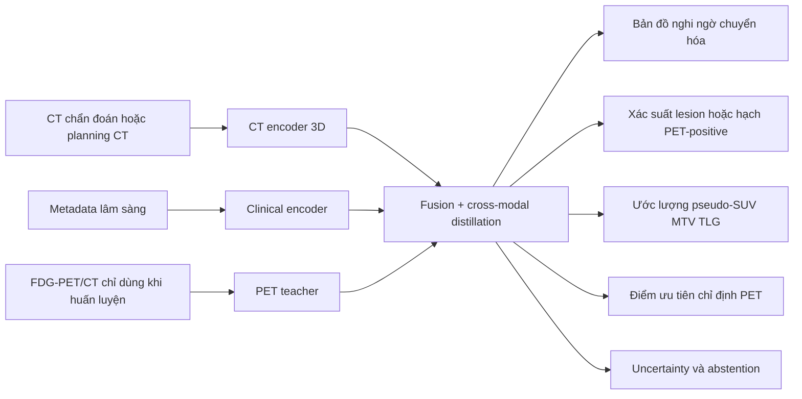
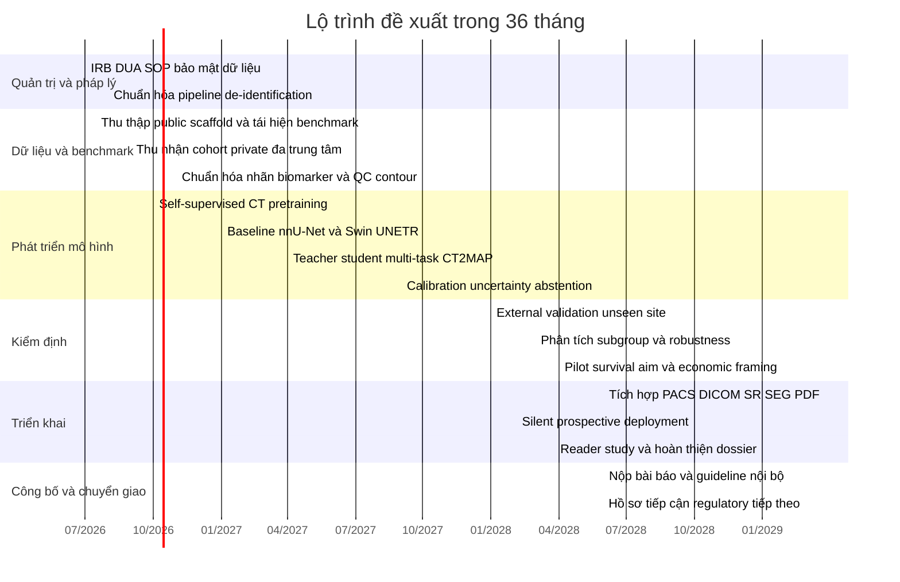

# Đề cương dự án CT2MAP cho suy diễn bản đồ chuyển hóa từ CT nhằm tối ưu chỉ định PET

## Tóm tắt điều hành

PET/CT là phương thức hình ảnh quan trọng trong ung thư học, được các guideline chuyên ngành dùng cho chỉ định, thực hiện, diễn giải và báo cáo trong chẩn đoán hình ảnh ung thư; đồng thời, WHO nhấn mạnh rằng nhiều quốc gia thu nhập thấp và trung bình thấp vẫn thiếu thiết bị và nhân lực hình ảnh học, còn IAEA lưu ý PET/CT làm bệnh nhân phơi nhiễm bức xạ từ cả CT lẫn PET, với riêng CT toàn thân có thể dao động khoảng 7 mSv ở khảo sát định vị đến khoảng 30 mSv ở CT chẩn đoán độ phân giải cao, và thành phần PET với FDG khoảng 8 mSv ở người lớn dùng 400 MBq. 

Bối cảnh nghiên cứu CT-to-PET hiện nay đã chứng minh tính khả thi của việc suy diễn thông tin PET từ CT: một nghiên cứu proof-of-concept trên ung thư phổi cho thấy synthetic PET từ CT có giá trị về chất lượng ảnh, chẩn đoán, tiên lượng và radiogenomics; trong khi một công trình gần đây hơn đưa ra mô hình diffusion có điều kiện cho CT-to-PET cùng bộ dữ liệu lớn tới 2.028.628 cặp ảnh CT-PET. Tuy vậy, phần lớn hướng này vẫn tối ưu hóa **ảnh PET giả lập toàn phần**, tức một đầu ra hấp dẫn về mặt hình ảnh nhưng khó đưa vào quy trình lâm sàng và quản trị rủi ro hơn một hệ thống quyết định hỗ trợ có đầu ra giới hạn, diễn giải được và có cơ chế từ chối khi bất định cao. 

Khuyến nghị mạnh nhất cho một **đề tài grant cấp quốc gia** là không làm “CT-to-PET” thuần túy, mà xây dựng một dự án liên quan chặt chẽ nhưng khác biệt rõ ràng: **CT2MAP**, tức hệ AI dùng **CT thường quy + dữ liệu lâm sàng** để suy diễn **bản đồ chuyển hóa mức thấp, tổn thương/nghi ngờ hạch có tính chuyển hóa cao, các surrogate biomarker kiểu PET như SUV/MTV/TLG ở mức lesion hoặc bệnh nhân, cùng xác suất ưu tiên chỉ định PET và uncertainty**. Ở mức triển khai, mô hình này không trả về một chuỗi PET “giả” có thể bị nhầm với PET thực; thay vào đó, nó trả về **DICOM SEG/DICOM SR/FHIR Observation** và báo cáo triage, nên gần với mô hình SaMD hỗ trợ quyết định hơn là “thay thế PET”. Cách đặt bài toán này giữ được mục tiêu cốt lõi của CT-to-PET — suy ra thông tin chức năng từ CT — nhưng tránh trở thành một bản sao gần giống của bài toán sinh ảnh. 

Nếu phải chọn bệnh đích khi hồ sơ grant chưa chốt bệnh, tôi khuyến nghị **ung thư đầu cổ** làm chỉ định khởi đầu vì đây là vùng có public data rất mạnh: bộ dữ liệu đa trung tâm gần đây có **1.123** ca PET/CT được chú thích từ **10 trung tâm quốc tế**, kèm GTV nguyên phát, GTV hạch, TNM, HPV, outcomes dài hạn và một phần liều xạ; ngoài ra các phiên bản HECKTOR trước đó đã chứng minh khả năng benchmark segmentation và outcome prediction trên dữ liệu PET/CT đầu cổ đa trung tâm, còn TCIA có thêm bộ Head-Neck-PET-CT **298** bệnh nhân với FDG-PET/CT và planning CT. 

Ở mặt biomarker, lựa chọn này cũng hợp lý vì FDG-PET trong ung thư đầu cổ đã cho thấy ý nghĩa tiên lượng của các chỉ số như SUVmax, metabolic tumor volume, total lesion glycolysis và asphericity; một phân tích đa trung tâm gần đây gồm **1.104** bệnh nhân HNSCC đã đánh giá vai trò tiên lượng độc lập của asphericity trên PET trước điều trị. Điều đó nghĩa là nếu AI không cần tái tạo toàn bộ PET mà chỉ tái tạo phần **tín hiệu lâm sàng có giá trị quyết định**, thì bài toán vừa thực dụng hơn vừa gần bệnh học hơn.

## Cơ sở lâm sàng và khoảng trống so với CT-to-PET

Khoảng trống lớn nhất trong đa số nghiên cứu CT-to-PET hiện nay nằm ở **đầu ra** và **đầu vào thực tế**. Về đầu ra, synthetic PET toàn ảnh tạo ra một vật thể hình ảnh có vẻ quen thuộc với bác sĩ nhưng mang rủi ro “hallucination” theo nghĩa lâm sàng: mô hình có thể khá thuyết phục về mặt thị giác mà không trực tiếp tối ưu các quyết định thực sự quan trọng như phát hiện hạch dương tính, ước lượng metabolic burden, hay quyết định bệnh nhân nào cần PET ưu tiên. Về đầu vào, nhiều pipeline CT-to-PET học từ CT đi cùng PET/CT trong cùng lần chụp, trong khi IAEA nhấn mạnh thành phần CT trong PET/CT có thể chỉ là CT định vị hoặc CT chẩn đoán với mức chất lượng và liều rất khác nhau; vì vậy, nếu đích triển khai là **CT chẩn đoán thường quy** hoặc **planning CT**, thì huấn luyện chỉ trên attenuation/localization CT có thể gây lệch miền đầu vào khi ra thực địa. citeturn17view0turn15view1turn0search13

Chính vì vậy, điểm mới nên được nhấn mạnh trong grant không phải là “chúng tôi cũng sinh PET từ CT”, mà là **chuyển bài toán từ image translation sang clinically actionable metabolic inference**. Trong hướng này, PET vẫn được dùng như “giáo viên” ở giai đoạn huấn luyện, nhưng mô hình CT-only ở giai đoạn suy luận chỉ xuất ra các thực thể lâm sàng có kiểm soát: vùng nghi ngờ tăng chuyển hóa, burden score, xác suất PET-positive, xác suất hạch có hoạt tính, và uncertainty. Đây là thay đổi có ý nghĩa khoa học lẫn regulatory vì nó gắn hệ thống với mục đích sử dụng rõ hơn, phù hợp hơn với logic đánh giá SaMD của IMDRF: cần chứng minh **valid clinical association**, **analytical validation**, và **clinical validation**, thay vì chỉ chứng minh synthetic image “trông giống PET”. citeturn23view0turn14view8

Một điểm mạnh khác cho hồ sơ grant là có thể lập luận rằng dự án này **tối ưu sử dụng nguồn lực PET**, không phải “thay thế PET”. WHO nêu rõ PET/PET-CT nằm trong nhóm hình ảnh lai có vai trò trung tâm trong chẩn đoán và điều trị, nhưng nhiều hệ thống y tế còn hạn chế thiết bị và nhân lực. Với framing như vậy, sản phẩm AI không cạnh tranh trực tiếp với PET mà phục vụ ba nhiệm vụ cụ thể hơn: sàng lọc ca cần PET ưu tiên, chuẩn hóa đánh giá nguy cơ chuyển hóa từ CT, và hỗ trợ các workflow như contouring/xạ trị hoặc reviewer triage ở các trung tâm có tải cao. citeturn19view0turn14view7

Từ góc độ dữ liệu và khoa học, ung thư đầu cổ là lựa chọn “feasible first, expandable later”. Bộ dữ liệu 1.123 ca đa trung tâm hiện nay cho phép phát triển segmentation, HPV prediction và recurrence-free survival; HECKTOR 2021 đã có **325** ảnh từ **6** trung tâm cho segmentation và PFS; còn bộ Head-Neck-PET-CT trên TCIA có **298** bệnh nhân với PET/CT và planning CT. Nếu reviewer muốn bệnh gánh nặng dân số cao hơn, cùng kiến trúc có thể chuyển sang **NSCLC** ở giai đoạn hai, tận dụng NSCLC Radiogenomics **211** ca có CT, PET/CT, segmentation, PET metrics, genomics và outcomes, cùng autoPET nơi có **168** ca ung thư phổi dương tính trong tổng thể 1.014 khảo sát FDG-PET/CT. citeturn15view2turn16view0turn3search1turn3search0turn14view2

## Khái niệm dự án được khuyến nghị

**Tên đề xuất:** **CT2MAP-HN** — *CT to Metabolic Atlas and Prioritization for Head-and-Neck Oncology*.

**Mục tiêu dự án:** phát triển và kiểm định một hệ AI dùng **CT chẩn đoán thường quy hoặc planning CT** cùng dữ liệu lâm sàng tối thiểu để suy diễn **PET-surrogate atlas** cho ung thư đầu cổ, gồm ba lớp đầu ra:  
**một**, bản đồ nghi ngờ chuyển hóa/hạch hoạt tính ở không gian CT;  
**hai**, các surrogate biomarker kiểu PET ở mức lesion và bệnh nhân như SUVpeak/SUVmax theo bins hay xấp xỉ liên tục, MTV/TLG hoặc risk class;  
**ba**, một **điểm ưu tiên chỉ định PET** kèm uncertainty và cơ chế abstention.

**Động cơ lâm sàng:** dự án nhắm tới các điểm đau rất cụ thể trong thực hành. Ở bệnh nhân đầu cổ, PET/CT đóng vai trò trong staging, đánh giá hạch, hỗ trợ xạ trị và tiên lượng; nhưng nếu năng lực PET hạn chế, bệnh viện cần biết ai nên được ưu tiên PET sớm, ai có thể trì hoãn, và ai cần escalation vì CT gợi ý mức burden chuyển hóa cao. Dự án vì vậy hướng tới tối ưu luồng công việc và chuẩn hóa ra quyết định, thay vì thay thế xét nghiệm chuẩn. citeturn14view7turn15view2turn16view0turn9search12

**Tính mới so với CT-to-PET:**  
Thứ nhất, đầu ra không phải ảnh PET toàn phần mà là **surrogate map + biomarker + triage**, nên khác đáng kể về objective function và intended use.  
Thứ hai, đầu vào được thiết kế để phù hợp thực tế triển khai: ưu tiên **routine diagnostic CT / planning CT** ghép với PET/CT theo cửa sổ thời gian ngắn, thay vì chỉ attenuation CT của hệ PET/CT. Điều này giúp thu hẹp khoảng cách “bench-to-bedside”.  
Thứ ba, sản phẩm final được đóng gói dưới dạng **derived outputs** như segmentation/report/observation có watermark AI-derived, không tạo ra một chuỗi PET giả dễ bị diễn giải như ĐÚNG PET. citeturn17view0turn17view4turn14view11turn23view0

Bảng dưới đây so sánh ba phương án khả thi để nhóm viết grant trình bày với hội đồng khoa học; trong ba phương án, tôi khuyến nghị **phương án đa nhiệm CT+clinical→PET surrogate atlas** làm hướng chính, còn phương án diffusion synthetic PET và functional-contrast prediction nên được đặt như baseline/nhánh phụ.

| Phương án | Input và output | Kiến trúc gợi ý | Ưu điểm | Hạn chế | Mức phù hợp với grant |
|---|---|---|---|---|---|
| **Synthetic PET bằng diffusion** | CT → ảnh PET giả lập toàn voxel | Latent diffusion có điều kiện, tận dụng lợi thế latent space và cross-attention; tham chiếu gần nhất là CT-to-PET diffusion CPDM. citeturn15view1turn15view5turn15view6 | Dễ benchmark với văn liệu hiện có; trực quan với reviewer; có baseline mạnh từ CT-to-PET. citeturn15view0turn0search1 | Dễ bị xem là gần trùng lặp với CT-to-PET; compute cao; inference tuần tự; đầu ra khó quản trị rủi ro hơn. Latent diffusion giúp giảm chi phí so với pixel-space diffusion nhưng vẫn không tối ưu trực tiếp quyết định lâm sàng. citeturn15view5turn15view6 | **Trung bình** cho baseline, **thấp** cho hướng chính |
| **Đa nhiệm CT+clinical → metabolic surrogate atlas** | CT + metadata lâm sàng → metabolic saliency map + lesion/hạch risk + pseudo-SUV/MTV/TLG + PET-triage + uncertainty | CT encoder kiểu nnU-Net/Swin UNETR, tabular encoder, PET-teacher chỉ dùng khi huấn luyện, distillation/fusion đa nhiệm. nnU-Net là baseline rất mạnh và tự cấu hình; Swin UNETR có bằng chứng pretrain tự giám sát trên 5.050 CT. citeturn14view12turn5search1turn5search5 | Mới hơn CT-to-PET nhưng vẫn bám mục tiêu cốt lõi; output gần nhu cầu lâm sàng; ít rủi ro regulatory hơn; data demand và compute vừa phải hơn diffusion toàn ảnh. | Cần định nghĩa biomarker/triage endpoint thật chặt và tránh overclaim “thay PET”. | **Cao nhất** |
| **Functional-contrast prediction** | CT + metadata → phenotype của tracer/chức năng chuyên biệt, ví dụ FDG-avidity class, FLT-like proliferation score hoặc PSMA-avid phenotype | Shared CT encoder + tracer/task-specific experts; learned biomarker heads; có thể dùng multi-task hoặc mixture-of-experts. | Rất mới; mở đường tới precision oncology đa tracer. Có dữ liệu công khai cho FLT-Breast và PSMA-PET-CT-Lesions để làm pilot. citeturn4search0turn13search0turn13search10 | Dữ liệu tracer chuyên biệt còn manh mún; nguy cơ grant bị chê “quá tham vọng” nếu đặt làm trục chính đầu tiên. | **Tốt** như aim phụ hoặc work package mở rộng |

Một flowchart ở mức hệ thống cho phương án khuyến nghị như sau:

Thiết kế này tương thích với logic “PET là nguồn nhãn giàu thông tin trong huấn luyện, nhưng CT-only là chế độ triển khai”. Nó cũng cho phép viết proposal theo cấu trúc rất thuyết phục: **Aim lâm sàng** là tối ưu hóa chỉ định PET; **Aim AI** là học biểu diễn chuyển hóa có điều kiện từ CT; **Aim triển khai** là PACS-integrated SaMD support. citeturn23view0turn14view8

## Kế hoạch kỹ thuật chi tiết

**Kiến trúc khuyến nghị ở mức thành phần** nên gồm sáu khối. Khối thứ nhất là **CT encoder 3D**; về thực dụng, nên triển khai song song một baseline nnU-Net và một backbone transformer như Swin UNETR để giảm rủi ro grant, vì nnU-Net nổi tiếng mạnh và tự cấu hình, còn Swin UNETR có lợi thế pretraining tự giám sát trên CT. Khối thứ hai là **clinical encoder** cho tuổi, giới, hút thuốc, p16/HPV, T/N stage, glucose máu, uptake time, contrast status, vendor/series metadata. Khối thứ ba là **PET teacher branch** chỉ bật trong train để trích xuất “metabolic embeddings”. Khối thứ tư là **cross-modal alignment** dùng distillation/contrastive loss để ép CT học latent space giàu thông tin PET. Khối thứ năm là **đa đầu ra** cho segmentation/detection, biomarker regression hoặc ordinal classification, patient-level triage, và nếu muốn thì survival head. Khối thứ sáu là **uncertainty/calibration layer**, nên dùng deep ensembles nhẹ hoặc MC dropout + temperature scaling; nếu muốn mạnh tay hơn, có thể bổ sung conformal prediction để tạo vùng dự báo có coverage định lượng. Cấu phần nền tảng cho encoder và diffusion đều có cơ sở tốt từ văn liệu hiện hành. citeturn14view12turn5search5turn15view5

**Dữ liệu cần có** cho dự án nên được thiết kế theo đúng intended use, đây là điểm rất quan trọng khi viết grant. Nếu mục tiêu triển khai là CT thường quy, bộ private cohort không nên chỉ lấy CT trong PET/CT scanner; thay vào đó, nên ưu tiên **diagnostic contrast-enhanced CT hoặc planning CT** được thực hiện trong vòng khoảng **7–14 ngày** trước PET/CT, và loại trừ trường hợp có can thiệp điều trị làm thay đổi burden giữa hai lần chụp. Với HNSCC, tôi khuyến nghị ba tầng dữ liệu như sau.

| Hạng mục dữ liệu | Mức tối thiểu khả thi | Mức cạnh tranh cho grant quốc gia | Ghi chú triển khai |
|---|---:|---:|---|
| CT không nhãn để pretrain tự giám sát | 5.000 scan | 10.000–20.000 scan | Swin UNETR đã chứng minh pretraining trên 5.050 CT công khai có ích cho downstream CT tasks. citeturn5search5 |
| Cặp **routine CT / planning CT ↔ FDG-PET/CT** để train chính | 600–800 ca | 1.200–1.800 ca | Nên đến từ ít nhất 4 trung tâm, có metadata scanner/protocol đầy đủ. |
| External holdout thật sự “unseen site” | 200–300 ca | 550–600 ca | Cỡ 550–600 đặc biệt hợp lý nếu muốn power tốt cho sensitivity/specificity ở external test. citeturn2search0turn10calculator0turn10calculator1 |
| Chú thích lesion hoặc hạch mức chuyên gia | 200–300 ca | 400–500 ca | Có thể dùng semi-auto PET segmentation để giảm tải, sau đó expert chỉnh subset. |
| Nhãn outcome thứ cấp | 300–400 ca | 500–800 ca | Tối thiểu cần follow-up đủ dài cho RFS hoặc recurrence. |
| Pilot dữ liệu cho aim mở rộng FLT/PSMA | 50–80 ca | 100–200 ca | Dùng để chứng minh khả năng mở rộng sang functional-contrast prediction. ACRIN-FLT-Breast có 83 ca; PSMA-PET-CT-Lesions có 597 studies từ 378 bệnh nhân. citeturn4search0turn13search10 |

**Public datasets nên ưu tiên** cho giai đoạn đầu gồm: bộ HNSCC đa trung tâm 1.123 PET/CT có GTVp/GTVn/TNM/HPV/outcome; HECKTOR lịch sử để tái hiện benchmark segmentation/PFS; TCIA Head-Neck-PET-CT cho planning CT; FDG-PET-CT-Lesions/autoPET cho lesion-centric pretraining; NSCLC Radiogenomics cho transfer và radiogenomics; ACRIN-FLT-Breast cho aim phụ về proliferation; và PSMA-PET-CT-Lesions cho nhánh đa-tracer tương lai. Các bộ này tạo thành một “public scaffold” rất mạnh trước khi dữ liệu private quốc gia vào đầy đủ. citeturn15view2turn16view0turn3search1turn14view2turn3search0turn4search0turn13search10

**Nhãn cần thu thập** nên được chia thành ba tầng để tối ưu chi phí. Tầng bắt buộc là nhãn sinh ra tự động từ PET thật: SUVmax/SUVpeak, MTV/TLG, lesion counts, site of nodal positivity, primary-tumor burden class. Tầng bán thủ công là contour lesion/hạch cho một subset nhằm dạy detection/segmentation và audit chất lượng. Tầng giàu thông tin lâm sàng là TNM, HPV/p16, histology, glucose trước chụp, uptake time, contrast status, therapy status, recurrence và survival. Với HNSCC, public data hiện đã chứng minh việc có GTVp, GTVn, TNM, HPV và outcome là hoàn toàn thực tế ở quy mô lớn. citeturn15view2turn15view4

**Tiền xử lý** nên đi theo triết lý “chuẩn hóa cái cần chuẩn hóa, giữ lại dị biệt cần học”. Tôi khuyến nghị: chuẩn hóa orientation; resample CT về voxel isotropic thực dụng ở 1.0–1.5 mm cho ROI đầu cổ; body/neck crop tự động; lưu đồng thời soft-tissue window và bone window; chuẩn hóa SUV cho PET teacher; giữ scanner/vendor, slice thickness, reconstruction kernel như metadata đầu vào để mô hình biết bối cảnh acquisition thay vì cố làm mọi thứ đồng nhất quá mức. Dữ liệu PET/CT đa trung tâm thay đổi đáng kể theo giao thức; bộ HNSCC đa trung tâm mới công khai nhấn mạnh sự đa dạng acquisition giữa 10 trung tâm, trong khi autoPET FDG lại là single-scanner dataset — rất tốt cho predevelopment nhưng không đủ một mình cho external generalization. citeturn15view3turn14view2

**Augmentation** nên phục vụ đúng hai mục tiêu: robust với CT thực địa và robust với dịch chuyển miền. Bộ augmentation đề xuất gồm affine/deformable nhẹ, HU shift, blur và noise mô phỏng kernel khác nhau, metal artefact augmentation, contrast injection variability, simulated missing slices, crop jitter quanh vùng cổ, và một augmentation đặc biệt là **small spatial misregistration** để chống phụ thuộc thái quá vào alignment PET-CT lý tưởng. Nếu có multi-center đủ lớn, nên thêm domain-randomization theo vendor/protocol; nếu privacy cản trở gom dữ liệu, có thể bổ sung **federated learning** như phương án dự phòng, vì PET/CT segmentation đa viện đã có báo cáo sử dụng FL khả thi. Ngoài ra, ở tầng feature hoặc ordinal biomarker, có thể thí điểm ComBat/harmonization cho các feature nhạy batch effect, vì nghiên cứu radiomics PET đa trung tâm đã cho thấy ComBat có thể hữu ích. citeturn8search5turn8search17turn8search0

**Chiến lược huấn luyện** nên triển khai thành bốn giai đoạn. Giai đoạn đầu là self-supervised pretraining trên CT không nhãn. Giai đoạn hai là huấn luyện đa nhiệm trên paired CT-PET với PET teacher, sử dụng các loss khác nhau: Dice + focal cho lesion/hạch, Huber/L1 cho pseudo-SUV hoặc biomarker liên tục, ordinal loss cho burden classes, contrastive/cosine distillation cho alignment latent, và ranking loss để bảo toàn thứ tự uptake của lesions trong cùng bệnh nhân. Giai đoạn ba là cross-site robustness, dùng leave-one-center-out, GroupDRO hoặc adversarial site-invariance. Giai đoạn bốn là calibration và selective prediction, nơi threshold cuối cùng được chốt theo yêu cầu lâm sàng ưu tiên độ nhạy/NPV cho triage. Vì nnU-Net là benchmark rất mạnh, nên grant nên cam kết “beat a strong baseline” thay vì chỉ so với baseline yếu. citeturn14view12turn5search8

## Đánh giá, triển khai và tuân thủ

**Kế hoạch đánh giá** cần tách rõ ba lớp: analytical validation, clinical validation, và deployment validation, đúng với framework SaMD của IMDRF. Ở lớp kỹ thuật, cần đánh giá lesion detection/segmentation, agreement của biomarker surrogate và calibration. Ở lớp lâm sàng, cần đánh giá xem mô hình có giúp xác định đúng bệnh nhân/hạch/tổn thương nhiều khả năng PET-positive hay không, có tăng NPV ở nhóm low-priority không, và có cải thiện reader workflow hay không. Ở lớp triển khai, cần đánh giá drift theo site và vendor, thời gian chạy, tỷ lệ abstention và integration errors. citeturn23view0turn14view8

Bảng endpoint khuyến nghị cho hồ sơ proposal như sau.

| Nhóm endpoint | Endpoint chính | Thước đo thống kê nên dùng | Ghi chú |
|---|---|---|---|
| Kỹ thuật | Phát hiện lesion/hạch PET-positive | Sensitivity, lesion-level F1, Dice đối với subset có mask | Nên báo cáo theo patient-level và lesion-level |
| Kỹ thuật | Agreement của pseudo-biomarker | CCC/ICC, MAE, Bland–Altman cho pseudo-SUV/MTV/TLG | Nếu biomarker quá nhiễu, chuyển sang ordinal bins |
| Lâm sàng | Triage “ca nào nên PET ưu tiên” | AUROC, AUPRC, sensitivity, specificity, NPV, PPV | Triage threshold nên ưu tiên sensitivity hoặc NPV cao |
| Lâm sàng | Nodal positivity hoặc high-burden class | AUROC, calibration, decision-curve analysis | Có giá trị trực tiếp cho HNSCC |
| Tiên lượng phụ | RFS hoặc recurrence risk | C-index, time-dependent AUC, calibration of survival risk | Chỉ nên là secondary endpoint ở grant vòng đầu |
| Tin cậy | Calibration và uncertainty | ECE, Brier score, coverage under conformal prediction | Bắt buộc nếu mô hình có abstention |
| Khái quát hóa | Cross-site robustness | Internal–external delta, forest plot theo center/vendor | Nên có leave-one-center-out và temporal holdout |

**Cỡ mẫu cho external validation** có thể trình bày rất rõ với hội đồng. Nếu endpoint chính là patient-level triage cho khả năng PET-positive có ích lâm sàng, dùng công thức precision-based của Buderer cho độ nhạy và độ đặc hiệu. Với giả định prevalence dương tính khoảng **40%**, sensitivity mục tiêu **0,85**, specificity mục tiêu **0,80**, và nửa bề rộng CI 95% là **0,05**, tổng cỡ mẫu cần thiết xấp xỉ **490** ca để ước lượng sensitivity và **410** ca để ước lượng specificity; vì vậy, test ngoại viện ở mức **550–600 ca** là hợp lý để còn dư chỗ cho loại trừ, missing data và subgroup analyses. Nếu prevalence thật chỉ khoảng **25%**, cỡ mẫu để bảo đảm precision cho sensitivity sẽ tăng lên gần **784** ca, nên hoặc phải tăng n, hoặc phải dùng chiến lược enriched sampling cho cohort đánh giá. citeturn2search0turn10calculator0turn10calculator1turn22calculator0turn22calculator1

**Reader study** nên được xem là giai đoạn gần cuối, không phải aim đầu tiên. Một thiết kế hợp lý là nghiên cứu MRMC retrospective với **5–7 bác sĩ đọc phim**, dùng **240–300 ca** đã enriched positives, so sánh CT-only với CT+AI về AUROC, thời gian đọc, confidence, và tỷ lệ referral hợp lý. Con số cuối cùng nên được chốt sau pilot variance theo khung Obuchowski-Rockette/DBM; việc nêu tên phương pháp này trong grant cho thấy nhóm hiểu đúng yêu cầu reader-study imaging, nhưng không cần hứa hẹn quá sớm về can thiệp lâm sàng. citeturn2search3

**Các chart nên chuẩn bị ngay từ proposal** để hội đồng thấy nhóm có kế hoạch đánh giá chặt chẽ gồm: ROC và precision-recall curves cho triage; calibration plot và histogram xác suất; Bland–Altman plot cho pseudo-SUV/MTV/TLG; scatter plot predicted-vs-true có đường identity; forest plot theo center/vendor/contrast status; waterfall plot uncertainty và tỷ lệ abstention theo case; Kaplan–Meier theo risk groups nếu làm aim survival; và decision-curve analysis để biểu diễn net benefit của việc dùng AI trong chỉ định PET. Những chart này không chỉ là trình bày đẹp mà phản ánh đúng các câu hỏi: mô hình có chính xác, có tin cậy, có khái quát hóa và có hữu ích lâm sàng hay không.

**Triển khai vào PACS/RIS** nên đi theo chiến lược bảo thủ và thực dụng. DICOM và HL7/FHIR đã có hướng chuẩn hóa tích hợp imaging-information systems; DICOM WG-20 nhấn mạnh interoperability giữa imaging systems và information systems dùng HL7, còn FHIR là chuẩn trao đổi dữ liệu y tế điện tử dựa trên resource model. Đối với sản phẩm này, đầu ra tốt nhất là **DICOM SEG** cho lesion/hạch hoặc vùng saliency có ngưỡng, **DICOM SR/PDF** cho biomarker và triage score, và **FHIR Observation/DiagnosticReport** nếu bệnh viện có gateway FHIR. Tôi không khuyến nghị lưu output dưới dạng series PET giả trong PACS thường quy, trừ khi có lý do nghiên cứu rất cụ thể và watermark cực rõ. citeturn17view4turn14view11

Về hạ tầng, baseline từ autoPET cho thấy pipeline segmentation 3D kiểu nnU-Net có thể chạy trong cấu hình **16 GB VRAM** trên challenge baseline; do đó một hệ CT-only ROI-focused thường sẽ khả thi trên **1 GPU 16–24 GB** cho suy luận và **2–4 GPU 40–80 GB** cho huấn luyện thoải mái hơn, tùy backbone cuối cùng. Cloud pricing của AWS và Google Cloud đều theo mô hình usage-based / on-demand cho compute và accelerator, nên line-item compute trong grant có thể viết theo dải chi phí thay vì báo giá cứng. Trong thực địa, hệ nên đặt on-prem hoặc trong private cloud bệnh viện, với thời gian suy luận mục tiêu dưới vài phút mỗi ca đầu cổ. citeturn13search7turn18search1turn18search3

**Đạo đức, pháp lý và quyền riêng tư** cần được viết như một work package riêng. DICOM PS3.15 có confidentiality profiles và action codes để de-identification; HHS mô tả hai đường de-identification chính trong HIPAA là **Expert Determination** và **Safe Harbor**; còn khung pháp lý EU cho dữ liệu cá nhân đặt GDPR làm trụ cột. Đối với grant quốc gia, thông điệp đúng là: tuân thủ luật địa phương là bắt buộc, nhưng thiết kế governance nên tham chiếu các chuẩn quốc tế mạnh như DICOM PS3.15, HIPAA de-identification, GDPR, IMDRF SaMD clinical evaluation và GMLP. Nếu dự án dự kiến continual learning sau triển khai, nên mô tả sớm một change-control strategy; FDA hiện đã có final guidance cho Predetermined Change Control Plan đối với AI-enabled devices. citeturn7search0turn17view2turn17view3turn23view0turn14view8turn24view0

Một lưu ý thực tiễn cuối cùng: nếu nhóm dùng các trợ lý LLM thương mại như ChatGPT, Claude hay Gemini để hỗ trợ rà soát tài liệu, viết protocol, sinh mã mẫu hoặc kiểm tra thống kê, chỉ nên đưa vào đó **dữ liệu đã khử định danh hoàn toàn hoặc dữ liệu tổng hợp**, không dán DICOM header thô, PHI, accession numbers hay báo cáo chưa de-identify. Quy trình này nên được ghi thành SOP riêng của dự án. citeturn17view2turn17view3turn7search0

## Rủi ro, lộ trình và ngân sách

Ma trận rủi ro nên được viết rõ trong proposal, vì đây là điểm mà hội đồng grant thường dùng để phân biệt dự án “AI demo” với dự án triển khai nghiêm túc.

| Rủi ro | Xác suất | Tác động | Mô tả | Giảm thiểu |
|---|---|---|---|---|
| Lệch miền giữa attenuation CT và routine diagnostic CT | Cao | Rất cao | Nếu train chủ yếu bằng CT trong PET/CT, mô hình có thể không chạy tốt trên CT thực tế. | Thu private cohort đúng intended use; bắt buộc holdout ở routine CT; metadata-aware training. |
| Label noise từ contour PET hoặc báo cáo lâm sàng | Trung bình | Cao | PET lesion labels có thể khác giữa readers, đặc biệt hạch nhỏ hoặc uptake sinh lý khó phân biệt. | Re-annotation expert cho subset; double-read các trường hợp khó; weak-to-strong label curriculum. |
| Overconfidence hoặc “hallucination” chức năng | Trung bình | Rất cao | CT-only model có thể đưa ra kết luận quá chắc ở ca ngoài miền. | Uncertainty head, abstention, calibration định kỳ, hiển thị “AI-derived metabolic surrogate”. |
| Domain shift đa trung tâm | Cao | Cao | Scanner, contrast, kernel, protocol khác nhau. | Leave-one-center-out, temporal holdout, harmonization, federated learning khi cần. citeturn8search0turn8search5 |
| Không đạt đủ cỡ mẫu external test | Trung bình | Cao | Dễ làm giảm sức mạnh bằng chứng khi nộp báo cáo giữa kỳ. | Thiết kế recruitment từ đầu; enriched validation; dùng public scaffold song song. |
| Chậm IRB hoặc DUA | Trung bình | Trung bình | Kéo dài giai đoạn data acquisition. | Tách work package pháp lý từ tháng đầu; chuẩn hóa template hợp đồng dữ liệu. |
| Tích hợp PACS/EHR phức tạp | Trung bình | Cao | Mâu thuẫn chuẩn, thiếu gateway FHIR hoặc quyền gửi DICOM back. | Bắt đầu với DICOM SEG/SR và PDF; FHIR là lớp tăng cường sau. citeturn17view4turn14view11 |
| Reviewer hiểu nhầm là “thay PET” | Trung bình | Cao | Rủi ro khoa học và regulatory. | Định vị rõ là triage/decision support; không gọi output là PET thật; không lưu thành PET series mặc định. |

Lộ trình 36 tháng phù hợp nhất cho grant cấp quốc gia là mô hình “retrospective first, prospective silent later”. Một Gantt đề xuất như sau:

**Ngân sách** nên được viết theo dải vì bạn chưa chốt compute và mặt bằng lương. Dưới đây là **dự toán khung** cho 3 năm, tính bằng USD để dễ chuyển đổi; khi nộp thực tế, chỉ cần nội địa hóa theo thang lương và giá dịch vụ trong nước.

| Hạng mục | Dải ước tính | Ghi chú |
|---|---:|---|
| Nhân sự khoa học và kỹ thuật | 240.000 – 650.000 | PI, đồng PI lâm sàng, 1–2 ML engineers, 1 data engineer, 1 RA/CRC, 1 statistician part-time, giờ chuyên gia contour/rà soát |
| Compute và lưu trữ | 25.000 – 120.000 | Cloud hoặc on-prem tương đương; chi phí phụ thuộc số GPU và thời gian huấn luyện. AWS/GCP vận hành theo usage-based pricing. citeturn18search1turn18search3 |
| Thu nhận dữ liệu, trích xuất PACS/RIS, de-identification | 25.000 – 90.000 | Bao gồm kỹ sư tích hợp, QC dữ liệu, storage trung gian |
| Gắn nhãn và kiểm định chuyên gia | 40.000 – 180.000 | Phần biến động lớn nhất sau nhân sự cốt lõi |
| Tích hợp PACS, QA, cybersecurity | 20.000 – 80.000 | DICOM SEG/SR/PDF, log audit, dashboard drift |
| Silent trial, reader study, thống kê | 20.000 – 100.000 | Incentive readers, analysis platform, coordination đa trung tâm |
| Dự phòng và công bố | 15.000 – 60.000 | Travel, xuất bản, contingency 5–10% |
| **Tổng khuyến nghị** | **385.000 – 1.280.000** | Phù hợp với grant quốc gia cỡ trung bình đến lớn |

Nếu muốn viết proposal “thông minh” hơn về nguồn lực, có thể trình bày ba kịch bản: **minimum viable science**, **competitive national grant**, và **flagship multicenter platform**. Kịch bản ở giữa — khoảng **500.000–800.000 USD** tương đương trong 3 năm — thường là điểm cân bằng tốt nhất giữa tham vọng khoa học và khả năng giải ngân.

## Tài liệu và bộ dữ liệu ưu tiên

Bảng dưới đây liệt kê các **dataset nên ưu tiên**, kèm **link chính thức** để bạn hoặc nhóm dự án truy cập trực tiếp. Tôi xếp theo mức độ hữu ích cho CT2MAP-HN, không phải theo độ nổi tiếng.

| Ưu tiên | Bộ dữ liệu | Link chính thức | Quy mô và modalities | Vai trò trong dự án |
|---|---|---|---|---|
| Rất cao | **Multimodal H&N dataset cho HECKTOR thế hệ mới** | [arXiv project](https://arxiv.org/abs/2509.00367) | 1.123 PET/CT đầu cổ từ 10 trung tâm; có GTVp/GTVn, TNM, HPV, outcomes, một phần RT dose. citeturn15view2 | Bộ trục chính cho chỉ định đầu cổ, segmentation, triage, outcome |
| Rất cao | **Head-Neck-PET-CT ở TCIA** | [TCIA collection](https://www.cancerimagingarchive.net/collection/head-neck-pet-ct/) | 298 bệnh nhân H&N; có FDG-PET/CT và planning CT. citeturn3search1 | Tốt cho external validation và bài toán planning CT ↔ PET |
| Rất cao | **FDG-PET-CT-Lesions / autoPET** | [TCIA collection](https://www.cancerimagingarchive.net/collection/fdg-pet-ct-lesions/) • [Grand Challenge](https://autopet.grand-challenge.org/Dataset/) | 1.014 whole-body FDG-PET/CT, 900 bệnh nhân; có mask tổn thương thủ công, gồm lung, lymphoma, melanoma và negative controls. citeturn14view2turn12search0 | Pretraining lesion-centric, negative-control mining, external robustness |
| Cao | **NSCLC Radiogenomics** | [TCIA collection](https://www.cancerimagingarchive.net/collection/nsclc-radiogenomics/) | 211 bệnh nhân; CT, PET/CT, segmentation, PET metrics, genomics, clinical outcomes. citeturn3search0 | Secondary transfer indication, radiogenomics analysis |
| Trung bình cao | **ACRIN-FLT-Breast** | [TCIA collection](https://www.cancerimagingarchive.net/collection/acrin-flt-breast/) | 83 bệnh nhân; FLT PET/CT và clinical response data. citeturn4search0turn4search4 | Pilot cho nhánh functional-contrast/proliferation prediction |
| Trung bình | **PSMA-PET-CT-Lesions** | [TCIA collection](https://www.cancerimagingarchive.net/collection/PSMA-PET-CT-Lesions/) | 597 studies từ 378 bệnh nhân; lesion masks thủ công. citeturn13search10turn13search0 | Aim phụ dài hạn về multi-tracer phenotype prediction |
| Bắt buộc nội bộ | **Cohort private đa trung tâm đúng intended use** | Không công khai | Routine diagnostic CT hoặc planning CT ghép PET/CT trong 7–14 ngày, kèm metadata và outcomes | Dữ liệu quyết định thành bại thật sự của grant |

Về **tài liệu ưu tiên đọc**, tôi khuyến nghị nhóm proposal tập trung trước vào các nguồn dưới đây; đây là danh mục nghiêng về **paper gốc**, **guideline chính thức** và **chuẩn hệ thống**, đúng tinh thần một hồ sơ grant cấp quốc gia.

| Nhóm | Tài liệu | Vì sao ưu tiên |
|---|---|---|
| CT-to-PET nền tảng | **Nguyen et al., CT to PET Translation: A Large-scale Dataset and Domain-Knowledge-Guided Diffusion Approach**. citeturn15view0turn15view1 | Cột mốc quan trọng để chỉ ra state of the art CT-to-PET và khoảng trống mà dự án của bạn sẽ vượt qua |
| CT-to-PET proof-of-concept | **Synthetic PET from CT improves diagnosis and prognosis for lung cancer**. citeturn0search1turn0search5 | Bằng chứng lâm sàng tốt nhất hiện có rằng tín hiệu PET có thể được suy diễn từ CT ở mức có ích |
| Dataset chính | **Saeed et al., A Multimodal and Multi-centric Head and Neck Cancer Dataset**. citeturn15view2turn15view4 | Chứng minh tính khả thi của chỉ định đầu cổ và sự sẵn sàng của dữ liệu đa trung tâm |
| Benchmark lịch sử | **Andrearczyk et al., Overview of the HECKTOR Challenge at MICCAI 2021**. citeturn16view0 | Cho thấy community benchmark, task definitions và mức hiệu năng thực tế |
| Dataset lesion-centric | **Gatidis et al., A whole-body FDG-PET/CT Dataset with manually annotated Tumor Lesions**. citeturn14view2 | Rất hữu ích để làm lesion pretraining và đánh giá giới hạn false positives |
| Prognostic PET biomarker | **Tumor Asphericity in FDG PET Is an Independent Prognostic Parameter in HNSCC**. citeturn9search12 | Giúp biện hộ vì sao output surrogate biomarker có ý nghĩa lâm sàng thực |
| Baseline model | **Isensee et al., nnU-Net**. citeturn14view12 | Baseline cực mạnh, giảm nguy cơ proposal “thiếu chuẩn so sánh mạnh” |
| Pretraining cho CT | **Tang et al., Swin UNETR self-supervised pre-training**. citeturn5search1turn5search5 | Hỗ trợ luận điểm cần hàng nghìn CT không nhãn để tăng hiệu quả downstream |
| Diffusion mechanics | **Rombach et al., Latent Diffusion Models**. citeturn15view5turn15view6 | Giải thích lợi ích nhưng cũng chi phí/đặc tính của diffusion nếu dùng làm baseline |
| Harmonization | **Impact of ComBat Harmonization on PET Radiomics-Based Tissue Classification**. citeturn8search0 | Cần cho multicenter robustness plan |
| Privacy-preserving scale-up | **Multi-institutional PET/CT Image Segmentation Using Federated Deep Learning**. citeturn8search5turn8search17 | Bằng chứng dự phòng nếu sharing dữ liệu gặp cản trở pháp lý |
| Guideline lâm sàng | **EANM/SNMMI guideline for FDG PET/CT tumour imaging**. citeturn14view7 | Nền tảng cho intended use, acquisition, reporting và narrative lâm sàng trong grant |
| Regulatory | **IMDRF SaMD Clinical Evaluation** và **FDA GMLP**. citeturn23view0turn14view8 | Khung phải có nếu proposal nhắm tới chuyển giao thật |
| Change management | **FDA PCCP final guidance**. citeturn24view0 | Quan trọng nếu nêu kế hoạch update model sau triển khai |
| Chuẩn tích hợp | **FHIR overview** và **DICOM WG-20 / DICOM PS3.15**. citeturn14view11turn17view4turn7search0 | Cần cho PACS/EHR integration và de-identification |

**Kết luận khuyến nghị:** nếu bạn cần một concept **khả thi, mới, gắn chặt với CT-to-PET nhưng không sao chép**, hãy chọn **CT2MAP-HN**: một nền tảng **CT-only, PET-supervised, đa nhiệm, có uncertainty**, tối ưu hóa **bản đồ chuyển hóa, biomarker surrogate và ưu tiên chỉ định PET** ở ung thư đầu cổ, với NSCLC là hướng mở rộng ngoại viện. Về mặt grant-writing, đây là điểm cân bằng rất tốt giữa **mới về khoa học**, **an toàn về regulatory**, **khả thi về dữ liệu**, và **có đường triển khai lâm sàng rõ ràng**. citeturn15view2turn16view0turn14view2turn23view0turn14view8